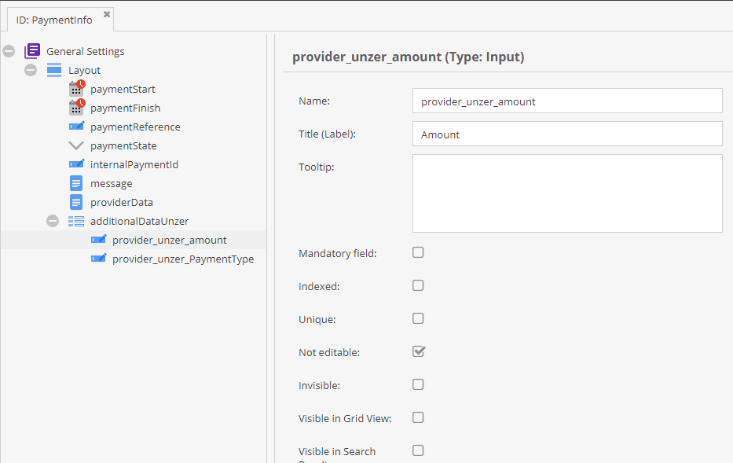

# Pimcore E-Commerce Framework Payment Provider - Unzer (former: Heidelpay)

## Unzer Web Integration

To integrate Unzer web integration see [Unzer docs](https://docs.unzer.com/integrate/web-integration) 
and follow following steps. 

The basic flow goes as following: 
- Unzer gets initialized via java script and depending on activated payment methods additional 
  form fields are injected to view template.   
- User selects payment method and enters additional information if necessary (e.g. credit card information).
- Information is submitted to unzer, payment transaction is started and payment id is returned. 
- Payment id is submitted back to Pimcore and Pimcore payment transaction is started. 
- If necessary user is redirected to payment provider (e.g. Paypal).
- If user comes back from external payment site, payment state is checked server-to-server between Pimcore and
  unzer and if successful order is committed and user is redirected to success page. 


## Installation

Install latest version with composer:
```bash 
composer require pimcore/payment-provider-unzer
```

Enable bundle via console or extensions manager in Pimcore backend:
```bash
php bin/console pimcore:bundle:enable PimcorePaymentProviderUnzerBundle
php bin/console pimcore:bundle:install PimcorePaymentProviderUnzerBundle
```

## Configuration
Setup payment provider in e-commerce framework configuration. The access keys you find
in Unzer documentation (or you will get them from Unzer for production integrations). 

```yml
unzer:
    provider_id: Pimcore\Bundle\EcommerceFrameworkBundle\PaymentManager\Payment\Unzer
    profile: sandbox
    profiles:
        sandbox:
            publicAccessKey: s-pub-2a10gsZJ2IeiiK80Wh68qrOzu4IZse6k
            privateAccessKey: s-priv-2a10BF2Cq2YvAo6ALSGHc3X7F42oWAIp
```      

Payment Information: Order payment section "Payment Informations" stores information about every payment trial by Customer.

Add additional fields in "PaymentInfo" fieldcollection, so that Order Manager stores information in Order object:



**Create View Template**

Create view template for payment method selection. This view template  
- needs to include a javascript and a css from Unzer. 
- has a list of all provided payment methods and depending of the payment method additional form elements. 
- includes a java script that handles data communication the data to Unzer. 
- has an additional form that submits successful payment information (Unzer payment id) back to Pimcore.  

**Sample template with Creditcard, Paypal and Sofort** 

```twig


 {# custom payment js, see below #}

<h4 class="mb-3">{{ 'checkout.payment' | trans }}</h4>

<div class="accordion" id="paymentAccordion">
    <div class="card">
        <div class="card-header" id="headingCC">
            <div class="display-4 mb-0">
                <button class="btn btn-link" type="button" data-toggle="collapse" data-target="#collapseCC" aria-expanded="true" aria-controls="collapseCC">
                    {{ 'checkout.creditcard' | trans }}
                </button>
                <div class="float-right mr-4">
                    
                    
                </div>
            </div>
        </div>

        <div id="collapseCC" class="collapse show" aria-labelledby="headingCC" data-parent="#paymentAccordion">
            <div class="card-body">

                <!-- credit card form as from the unzer docs -->
                <form id="cc-form" class="unzerUI form" novalidate>
                    <div class="field">
                        <div id="card-element-id-number" class="unzerInput">
                            <!-- Card number UI Element will be inserted here. -->
                        </div>
                    </div>
                    <div class="two fields">
                        <div class="field ten wide">
                            <div id="card-element-id-expiry" class="unzerInput">
                                <!-- Card expiry date UI Element will be inserted here. -->
                            </div>
                        </div>
                        <div class="field six wide">
                            <div id="card-element-id-cvc" class="unzerInput">
                                <!-- Card CVC UI Element will be inserted here. -->
                            </div>
                        </div>
                    </div>
                    <div class="field" id="error-holder" style="color: #9f3a38"> </div>
                    <div class="field">
                        <button id="submit-button" class="btn btn-success btn-block" type="submit">{{ 'general.creditcard.pay' | trans }}</button>
                    </div>
                </form>


            </div>
        </div>
    </div>
    <div class="card">
        <div class="card-header" id="headingPaypal">
            <div class="display-4 mb-0">
                <button class="btn btn-link" type="button" data-toggle="collapse" data-target="#collapsePaypal" aria-expanded="true" aria-controls="collapsePaypal">
                    {{ 'checkout.paypal' | trans }}
                </button>
                <div class="float-right mr-4">
                    
                </div>
            </div>
        </div>
        <div id="collapsePaypal" class="collapse" aria-labelledby="headingPaypal" data-parent="#paymentAccordion">
            <div class="card-body">

                <!-- paypal form as from the unzer docs -->
                <div class="field">
                    <button id="js-redirect-payment-method-paypal" class="btn btn-success btn-block">{{ 'general.paypal.pay' | trans }}</button>
                </div>

            </div>
        </div>
    </div>
    <div class="card">
        <div class="card-header" id="headingSofort">
            <div class="display-4 mb-0">
                <button class="btn btn-link" type="button" data-toggle="collapse" data-target="#collapseSofort" aria-expanded="true" aria-controls="collapseSofort">

                    {{ 'checkout.sofort' | trans }}

                </button>
                <div class="float-right mr-4">
                    
                </div>
            </div>
        </div>
        <div id="collapseSofort" class="collapse" aria-labelledby="headingSofort" data-parent="#paymentAccordion">
            <div class="card-body">

                <!-- redirect payment content as from the unzer docs -->
                <div class="field">
                    <button id="js-redirect-payment-method-paypal-sofort" class="btn btn-success btn-block">{{ 'checkout.sofort.pay' | trans }}</button>
                </div>

            </div>
        </div>
    </div>
</div>

<!-- Form to submit successful payment result to Pimcore -->
<form id="js-submit-payment-result" action="{{ path('shop-checkout-start-payment') }}">
    <input type="hidden" name="paymentMethod" class="js-payment-method-hidden" value=""/>
    <input type="hidden" name="paymentId" class="js-payment-id-hidden" value=""/>
</form>
```

**Sample Javascript (payment.js) with Creditcard, Paypal and Sofort**

```javascript
$(document).ready(function() {

    let unzerInstance = new unzer(_config.accessKey, {locale: 'en-GB'});

    let $errorHolder = $('#error-holder');

    let Card = unzerInstance.Card();
    // Rendering input fields
    Card.create('number', {
        containerId: 'card-element-id-number',
        onlyIframe: false
    });
    Card.create('expiry', {
        containerId: 'card-element-id-expiry',
        onlyIframe: false
    });
    Card.create('cvc', {
        containerId: 'card-element-id-cvc',
        onlyIframe: false
    });

    let ccForm = document.getElementById('cc-form');
    let submitPaymentResultForm = document.getElementById('js-submit-payment-result');

    // General event handling
    let buttonDisabled = {};
    let submitButton = document.getElementById('submit-button');
    submitButton.disabled = true;


    let successHandler = function(data) {
        console.log('success');
        data.method = data.method ? data.method : 'card';
        $('.js-payment-method-hidden').val(data.method);
        $('.js-payment-id-hidden').val(data.id);

        submitPaymentResultForm.submit();
    };

    let errorHandler = function(error) {
        console.log('error');
        $errorHolder.html(error.message);
    };

    Card.addEventListener('change', function(e) {
        if (e.success) {
            buttonDisabled[e.type] = true;
            submitButton.disabled = false;
            $errorHolder.html('')
        } else {
            buttonDisabled[e.type] = false;
            submitButton.disabled = true;
            $errorHolder.html(e.error)
        }
        submitButton.disabled = !(buttonDisabled.number && buttonDisabled.expiry && buttonDisabled.cvc);

    });


    ccForm.addEventListener('submit', function(event) {
        event.preventDefault();
        console.log('creditcard form submit');
        Card.createResource()
            .then(successHandler)
            .catch(errorHandler)
    });


    $('#js-redirect-payment-method-paypal').on('click', function(e){
        e.preventDefault();

        var Paypal = unzerInstance.Paypal();

        Paypal.createResource()
            .then(successHandler)
            .catch(errorHandler)
    });

    $('#js-redirect-payment-method-paypal-sofort').on('click', function(e){
        e.preventDefault();

        var Sofort = unzerInstance.Sofort();

        Sofort.createResource()
            .then(successHandler)
            .catch(errorHandler)
    });


});
```

5) **Create Controller Action for Payment Selection**

The only special thing in this controller action is to get public access key out of
payment provider and assign it to the template. 

```php
/**
 * @Route("/checkout-payment", name="shop-checkout-payment")
 *
 * @param Factory $factory
 * @return array
 */
public function checkoutPaymentAction(Factory $factory) {
    $cartManager = $factory->getCartManager();

    $cart = $cartManager->getOrCreateCartByName('cart');
    $checkoutManager = $factory->getCheckoutManager($cart);
    $paymentProvider = $checkoutManager->getPayment();

    $accessKey = '';
    if($paymentProvider instanceof Unzer) {
        $accessKey = $paymentProvider->getPublicAccessKey();
    }

    return [
        'cart' => $cart,
        'accessKey' => $accessKey
    ];
}
```


6) **Create Controller Action for Starting Payment**

To this action the paymentId of Unzer is submitted after payment transaction is started 
successfully on client side. 

Additionally an error action is defined to extract the error messages from Unzer. 

```php
/**
 * @Route("/checkout-start-payment", name="shop-checkout-start-payment")
 *
 * @param Request $request
 * @param Factory $factory
 * @return RedirectResponse
 */
public function startPaymentAction(Request $request, Factory $factory, LoggerInterface $logger) {
    try {
        $cartManager = $factory->getCartManager();
        $cart = $cartManager->getOrCreateCartByName('cart');

        /** @var CheckoutManagerInterface $checkoutManager */
        $checkoutManager = $factory->getCheckoutManager($cart);

        $paymentInfo = $checkoutManager->initOrderPayment();

        /** @var OnlineShopOrder $order */
        $order = $paymentInfo->getObject();

        $paymentConfig = new UnzerRequest();
        $paymentConfig->setInternalPaymentId($paymentInfo->getInternalPaymentId());
        $paymentConfig->setPaymentReference($request->get('paymentId'));
        $paymentConfig->setReturnUrl($this->generateUrl('shop-commit-order', ['order' => $order->getOrdernumber()], UrlGeneratorInterface::ABSOLUTE_URL));
        $paymentConfig->setErrorUrl($this->generateUrl('shop-checkout-payment-error', [], UrlGeneratorInterface::ABSOLUTE_URL));

        $response = $checkoutManager->startOrderPaymentWithPaymentProvider($paymentConfig);

        if($response instanceof UrlResponse) {
            return new RedirectResponse($response->getUrl());
        }
    } catch (\Exception $e) {
        $this->addFlash('danger', $e->getMessage());
        $logger->error($e->getMessage());
        return $this->redirectToRoute('shop-checkout-payment');
    }

}

/**
 * @Route("/payment-error", name = "shop-checkout-payment-error" )
 */
public function paymentErrorAction(Request $request, LoggerInterface $logger)
{
    $logger->error('payment error: ' . $request->get('merchantMessage'));

    if($clientMessage = $request->get('clientMessage')) {
        $this->addFlash('danger', $clientMessage);
    }

    return $this->redirectToRoute('shop-checkout-payment');
}
```


7) **Create Controller Action for Commit Order**
Finally commit order and redirect user to order success page. 

```php
/**
 * @Route("/payment-commit-order", name="shop-commit-order")
 *
 * @param Request $request
 * @param Factory $factory
 * @param LoggerInterface $logger
 * @param Translator $translator
 * @param SessionInterface $session
 * @return RedirectResponse
 * @throws \Pimcore\Bundle\EcommerceFrameworkBundle\Exception\UnsupportedException
 */
public function commitOrderAction(Request $request, Factory $factory, LoggerInterface $logger, Translator $translator, SessionInterface $session) {
    $order = OnlineShopOrder::getByOrdernumber($request->query->get('order'), 1);

    $cartManager = $factory->getCartManager();
    $cart = $cartManager->getOrCreateCartByName('cart');

    /**
     * @var CheckoutManagerInterface $checkoutManager
     */
    $checkoutManager = $factory->getCheckoutManager($cart);

    try {
        $order = $checkoutManager->handlePaymentResponseAndCommitOrderPayment([
            'order' => $order
        ]);

    } catch(\Exception $e) {
        $logger->error($e->getMessage());
    }

    if(!$order || $order->getOrderState() !== AbstractOrder::ORDER_STATE_COMMITTED) {

        $this->addFlash('danger', $translator->trans('checkout.payment-failed'));
        return $this->redirectToRoute('shop-checkout-payment');
    }

    if (!$session->isStarted()) {
        $session->start();
    }

    $session->set("last_order_id", $order->getId());

    return $this->redirectToRoute('shop-checkout-completed');
}
```

## Important Configuration
Please make sure that `serialize_precision` is set to a very high value, or even better to `-1` in order to prevent rounding issues with the unzer sdk. 
For details also see https://docs.unzer.com/integrate/php-sdk/installation/#php-configuration
